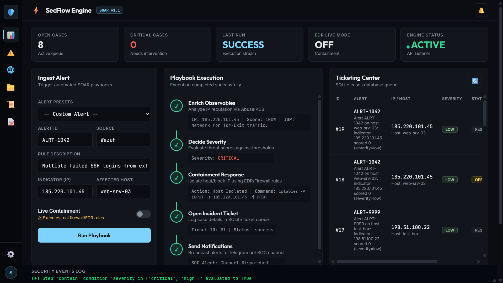
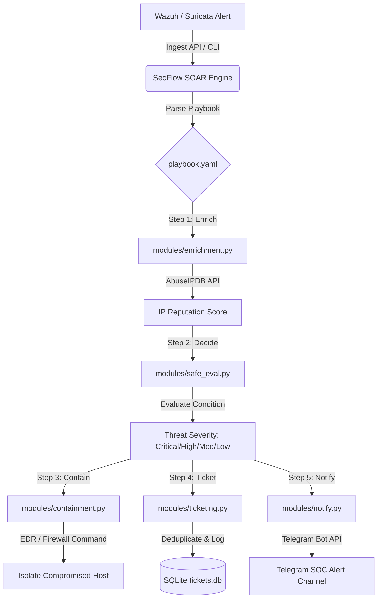

# ⚡ SecFlow Engine: SOAR Platform

[](https://opensource.org/licenses/MIT)
[](https://www.python.org/)
[](https://fastapi.tiangolo.com/)

**SecFlow Engine** is a lightweight, responsive Security Orchestration, Automation, and Response (SOAR) platform. It automates repetitive security operations tasks, reducing **alert fatigue** and accelerating the **incident response lifecycle** from ingestion to host isolation in seconds.

The platform executes declarative playbooks (defined in YAML) dynamically, routing security alerts and executing threat containment rules through a modern, responsive security command center dashboard.

---

## 📸 Dashboard Preview



---

## 🔴 The Real-World Problem Solved

Security Operations Centers (SOCs) are constantly flooded with hundreds of security alerts every day. Investigating these alerts manually is slow and repetitive:
* Manually querying threat intelligence APIs for indicator reputations.
* Logging tickets in tracker databases.
* Dispatching notification messages to communication channels.
* Executing containment commands on endpoints to isolate threats.

This manual response latency leaves networks vulnerable to rapid malware or lateral threat propagation. 

**SecFlow Engine solves this by automating the incident response workflow:**
1. **Automated Triage**: Automatically enriches IP observables via AbuseIPDB and maps severities.
2. **Instant Isolation**: Blocks/isolates hosts programmatically on critical alerts.
3. **Audit Trails**: Logs every run step, input, and output dynamically in SQLite and raw audit JSONs.
4. **Analyst Command Console**: Combines all tools (Threats feed, Network metrics, Assets tracking, Playbook run logs, and CSV reports exporters) in one unified dashboard.

---

## 📐 Architecture Workflow



---

## 🌟 Key Features

* **Session-Based Authentication**: Secure access with HTTP-only cookies and global fetch interceptors.
* **Dynamic Playbook Execution**: Parses unquoted variables and list matches via a secure Abstract Syntax Tree (AST) evaluator.
* **Incident Deduplication**: Programmatically checks the SQLite database for existing open cases before opening new tickets.
* **CLI Safety Safeguard**: Demands interactive validation before executing live containment scripts.
* **Interactive Dashboard (Concept B)**:
  * **Sidebar**: Quick view toggling (Dashboard, Threats Feed, Network Metrics, Assets tracker, Compliance logs, Reports export center).
  * **Threats Feed**: Enriched observables with Abuse IP scores and geographic tags.
  * **Network Panel**: Aggregates unique indicator sources, top attack countries, and ISP distributions.
  * **Reports Center**: Structured CSV exporters for Tickets database and Playbook runs history.

---

## ⚙️ Setup & Configuration

### 1. Prerequisite Dependencies
Make sure Python 3.10+ is installed, then clone the repository and run:
```bash
pip install -r requirements.txt
```

### 2. Configure Environment Variables (`.env`)
Create a `.env` file in the root directory to store your credentials:
```ini
# API Integrations
ABUSEIPDB_API_KEY=your_abuseipdb_api_key_here
TELEGRAM_BOT_TOKEN=your_telegram_bot_token_here
TELEGRAM_CHAT_ID=your_telegram_channel_or_chat_id

# Dashboard Credentials (Default)
ADMIN_USER=admin
# To use custom passwords, generate a SHA-256 hash
ADMIN_PASSWORD_HASH=ef2d127de37b942baad0614415b9c0d3ef8c0a87671167197171167116711671
```
*(Default credentials fallback is user: `admin`, password: `secflow123` if not configured in `.env`).*

### 3. Start the Web Server
Launch the FastAPI server:
```bash
python server.py
```
Open your browser and navigate to **`http://127.0.0.1:8000`** to access the dashboard.

---

## 🛠️ Usage

### Web Dashboard
* Sign in using your username and password.
* In the **Ingest Alert** panel, select a preset (SSH Brute-force, Tor Exit Node, Port Scan) or fill in a custom alert, then click **Run Playbook**.
* Watch the **Playbook Execution** pipeline run step-by-step in real-time, accompanied by live logs in the **Security Events Log** console at the bottom.

### Command Line Tool (CLI)
You can trigger playbook runs directly from the terminal:
```bash
python main.py --alert sample_alerts/sample_alert_malicious_ip.json
```
For live containment executions, use the `--live-contain` flag:
```bash
python main.py --alert sample_alerts/sample_alert_malicious_ip.json --live-contain
```

---

## 🧪 Running Automated Tests

Run the integration API test suite to verify settings routing, encryption key masking, SQLite ticketing, and playbook execution steps:
```bash
python test_server_api.py
```

---

## 📁 Repository Structure

```
SOAR-Playbook/
├── evidence/              # Saved SQLite database (tickets.db) & JSON run-logs
├── modules/               # Core SOAR modules (enrichment, containment, ticketing, notify, safe_eval)
├── sample_alerts/         # Sample JSON payloads for testing
├── web/                   # Frontend assets (index.html, login.html, styles.css)
├── main.py                # Command-line playbook execution engine
├── server.py              # FastAPI server & backend API routes
├── playbook.yaml          # Default playbooks definition file
├── requirements.txt       # Python dependencies
└── test_server_api.py     # Automated test suite
```

---

## 📜 License
Distributed under the MIT License. See `LICENSE` for more information.
